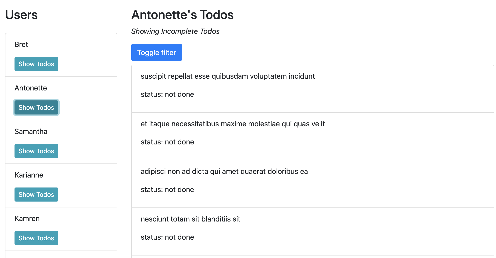

# Practice Mock Interview for Frontend - Thinkful

### Installation

* Clone or download this repo to your local machine
* Run `npm install` in the project folder
* Run `npm test` to see the required tests
* Run `npm start` to start the app

### Instructions

This is an empty React project generated from `create-react-app`. 

To complete this assignment, your app will need to achieve the following:

1. Upon first loading, it will display a list of usernames retrieved from an API, with a button labeled "Show Todos"
1. When the user clicks on a "Show Todos" button for a specific user, it will add a list of Todos to the display. This will require a second API call for the Todos.
1. A button labeled "Toggle filter" will toggle between showing only incomplete todos and showing ALL todos.
1. When the Todos first load, they will default to showing ONLY incomplete todos.

You will be required to follow the specific tasks below to make the tests pass.

### Mock wireframe

### Specific Tasks

If in doubt about a task, read the `App.test.js` and `TodosList.test.js` to understand what's required to pass.

1. Inside the App component, create two state variables: `users` and `currentUserId`
    - `users` is an Array that should be retrieved from the API at `https://jsonplaceholder.typicode.com/users` when the App component loads
    - `currentUserId` is a Number that starts as `null` and should change when a username is clicked
1. Each user should generate a `li` component that contains:
    - the username
    - a button with the label "Show Todos"
    - when clicked, the button will change the `currentUserId`
1. When a `currentUserId` exists (not `null`), a `TodosList` component should render inside the App component. Otherwise, the `TodosList` component should not render at all.
1. When mounted, the `TodosList` component should fetch the todos for the currently selected user at `https://jsonplaceholder.typicode.com/users/{userId}/todos`. It should update whenever the `currentUserId` changes. You will want to pass the `currentUserId` into the component as a prop.
1. The `TodosList` component should display ONLY the incomplete todos when it first loads
1. Each todo should generate a `li` component that contains the `todo.title`
1. At the top of the `TodosList` component, there should be
    - text that says "Showing [Incomplete / All] Todos for {username}"
    - a button with the label "Toggle filter"
    - when clicked, the list of Todos should change between ALL todos and only incomplete Todos